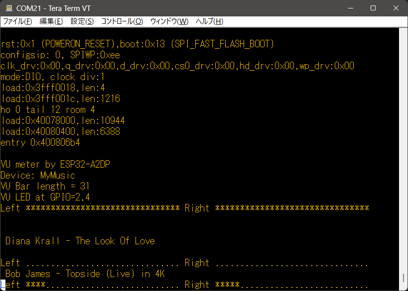
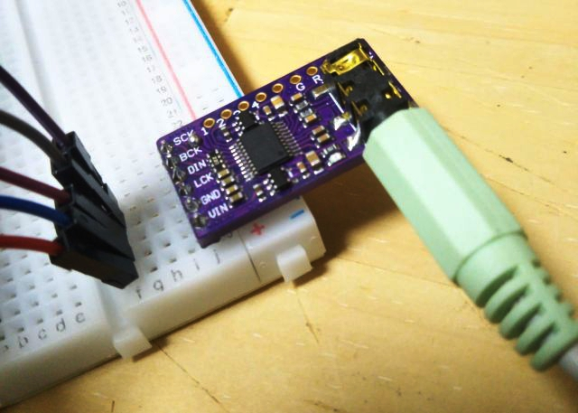

## ESP32-A2DP-VUmeter

 Streaming Music from Bluetooth with VU meter for tera terminal
  based on ESP32-A2DP by Phil Schatzmann
  at https://github.com/pschatzmann/ESP32-A2DP

coniferconifer added simple VU meter for tera term https://ttssh2.osdn.jp/

## not for Arduino IDE's serial monitor
I have no idea why the serial monitor by Arduino IDE does not provide realtime VUmeter, just 
by printing VU bar and CR at the end.
 
See #define VUMETER and #ifdef VUMETER section.
Max volume for BT audio output seems the best for ESP32-A2DP-VUmeter.

GPIO2 (Left) and GPIO4 (Right) can be used for VU LEDs , each pull donwned by appropriate current limiting resisters.

Output example 
<pre>
Ex. 
0dB 1kHz input
Left ******************************* Right *******************************

-5dB 1kHz input
Left ******************............. Right ******************.............

-10dB 1kHz input
Left **********..................... Right **********.....................
</pre>

I2S DAC by PCM5102A board is connected to ESP32 devkitC by
<pre>
GPIO23 -> DIN
GPIO25 -> LCK
GPIO26 -> BCK
5V -> VIN (inout to the on board 3.3V regulator)
GND -> GND
</pre>
## PCM5102A on board switch settings:
H1L(FLT),H2L(DEMP),H4L(FMT) are shorted to GND

H3L(XMST un mute) is connected to High side(3.3V)

## Tips: 
When ESP32 devkitC is connected to PC USB port, audio output is slightly noisy.
USB power from battery is ideal to remove noise, but I don't care noise when 
digital volume at PC or smartphone (Bluetooth source) is max.

## About VUMETER section

copyright 2022 coniferconifer

---

Licensed under the Apache License, Version 2.0 (the "License");
you may not use this file except in compliance with the License.
You may obtain a copy of the License at

http://www.apache.org/licenses/LICENSE-2.0

Unless required by applicable law or agreed to in writing, software
distributed under the License is distributed on an "AS IS" BASIS,
WITHOUT WARRANTIES OR CONDITIONS OF ANY KIND, either express or implied.
See the License for the specific language governing permissions and
limitations under the License.

---
